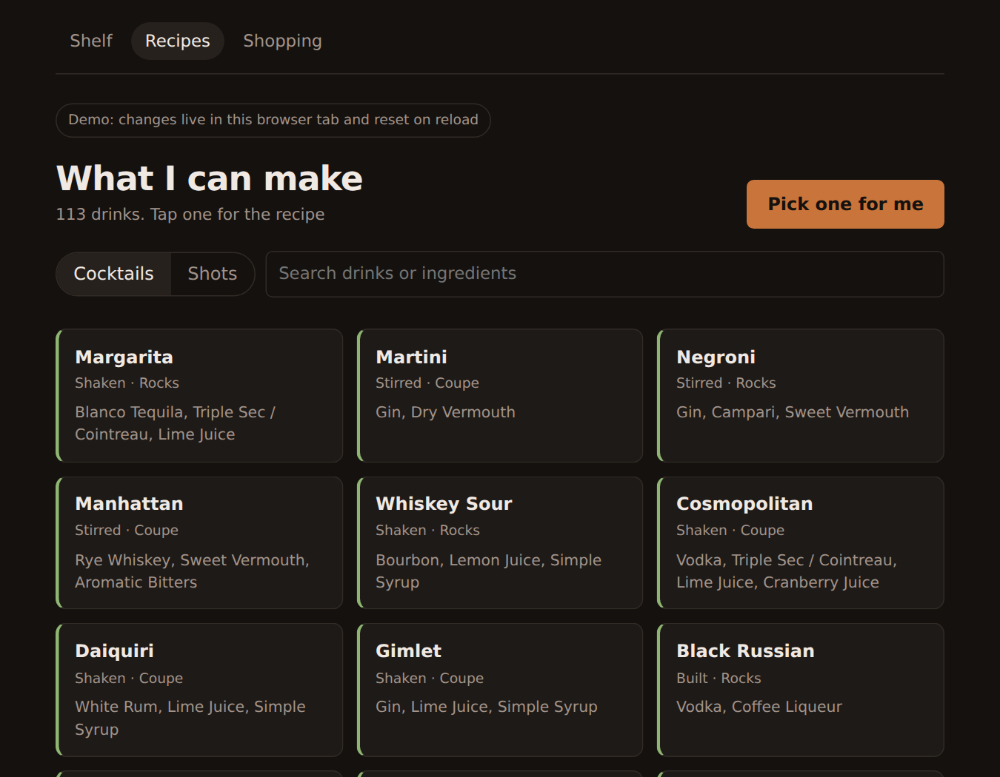
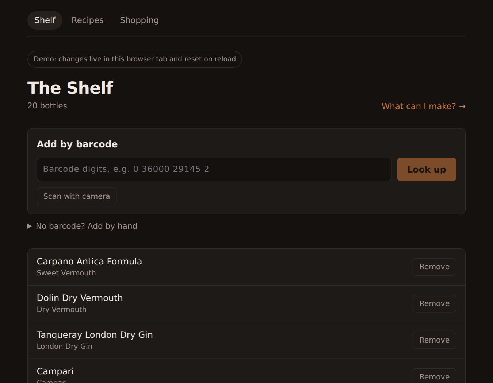
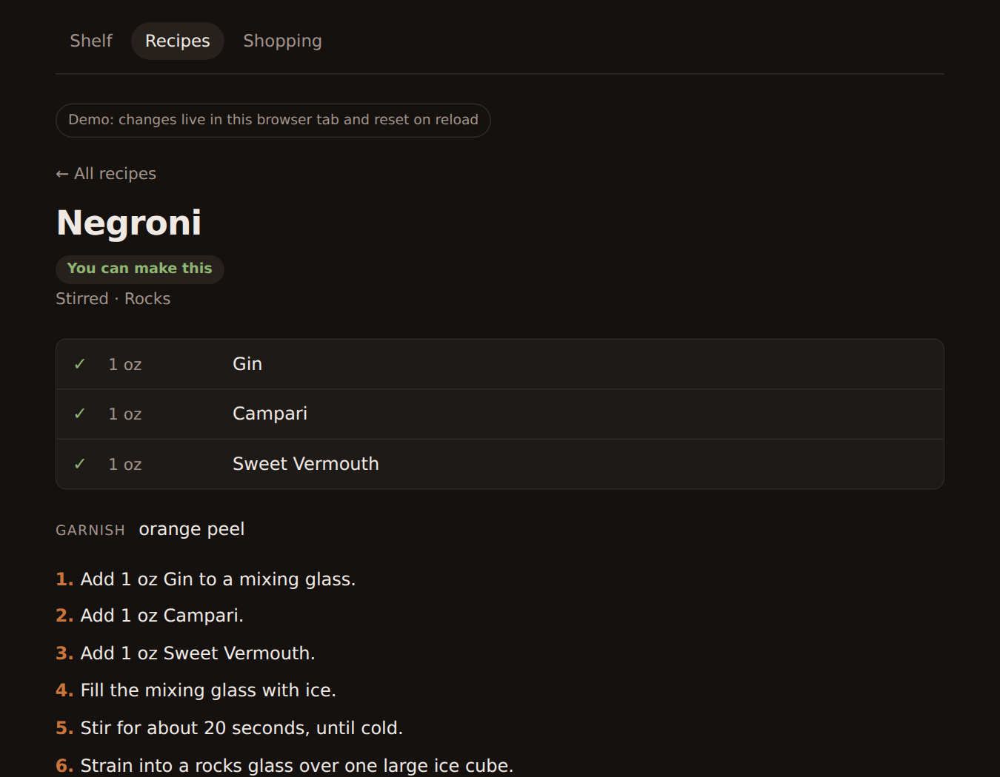
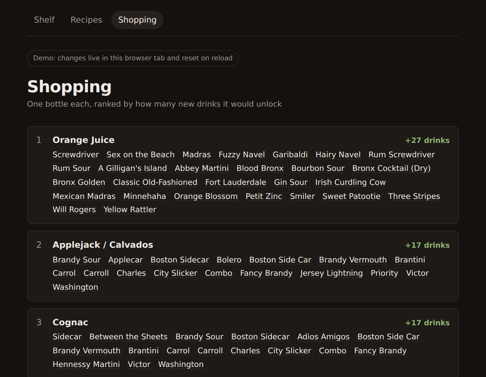

# Bar Inventory

Scan a bottle and it joins your shelf. The app then sorts about 1,000 cocktail recipes into what you can make right now, what is one ingredient short, and what you would need to buy.

**Live demo:** [brandonnakata.netlify.app/demos/bar](https://brandonnakata.netlify.app/demos/bar/) (runs entirely in the browser with sample data; changes reset on reload)



## Features

- **Shelf:** add bottles by barcode (typed or scanned with a phone camera) or by hand
- **Barcode lookup:** Open Food Facts first, then UPCitemdb, with every confirmed barcode remembered so a repeat scan needs no network
- **Recipes:** about 1,000 drinks, sorted makeable, one short, then everything else, most common first
- **Shopping list:** which single bottle would unlock the most new drinks
- **Recipe editor:** edit or hide any recipe from a phone, with numbered steps that fill in each recipe's own amounts
- **Wall panel:** a compact JSON feed for an iPad mounted in Home Assistant

| Shelf | Recipe | Shopping |
|---|---|---|
|  |  |  |

## How matching works

A barcode lookup returns "Carpano Antica Formula". A recipe asks for "sweet vermouth". Nothing in either string says they are the same thing.

Ingredients are stored as a tree (`backend/app/taxonomy.py`, about 190 categories):

```
fortified-wine
└── vermouth
    ├── sweet-vermouth
    └── dry-vermouth
```

Every bottle points at one node. A recipe line is satisfied by anything at or below the node it asks for, so a sweet vermouth counts for "vermouth" but a dry vermouth never counts for "sweet vermouth". Matching walks up from each owned bottle once, using a recursive SQL query, and unions the ancestors into one set. Every recipe is then checked against that set in a single pass.

A few placements are deliberate. Spiced rum sits under rum, so a rum and Coke accepts it. Flavored spirits like banana rum get their own branch, so they never quietly count as the rum in a Mojito.

## Stack

- **Backend:** Python, FastAPI, SQLite
- **Frontend:** React, React Router, Vite
- **Deployment:** Docker container running as a Home Assistant add-on on a Raspberry Pi 4
- **Demo:** the same React app built with an in-browser fake API, hosted on Netlify

## Running locally

Requires Python 3.10+ and Node.js 20+.

```bash
# Backend (http://localhost:8000, API docs at /docs)
cd backend
python -m venv .venv
source .venv/bin/activate        # Windows: .venv\Scripts\activate
pip install -r requirements.txt
uvicorn app.main:app --reload

# Frontend (http://localhost:5173, proxies /api to the backend)
cd frontend
npm install
npm run dev
```

The database (`backend/bar.db`) is created and seeded on first start.

To run the demo build with no backend: `npm run build:demo && npm run preview:demo`.

## Tests

```bash
cd backend && python run_tests.py    # 237 checks across 5 suites, standard library only
cd frontend && npm run check:demo    # demo JS matching agrees with the Python backend
cd frontend && npm run check:camera  # camera scan loop, driven by a fake camera
```

| Suite | Checks | Covers |
|---|---|---|
| `test_taxonomy.py` | 36 | tree walks, which bottles satisfy which requirements, no cycles |
| `test_recipes.py` | 38 | makeable and one-short verdicts, shopping list ranking and ties |
| `test_library.py` | 69 | every converted recipe is valid, step templates, phone edits survive restarts |
| `test_barcode.py` | 67 | check digits, lookup order and fallback, rate limits, server errors, timeouts, cache |
| `test_panel.py` | 27 | the panel's JSON contract, and that the panel and the React app agree |

The suites run against an in-memory SQLite database. Barcode sources are replaced with fakes, and the HTTP client is tested against a local server that can hang or return errors, so everything runs offline. GitHub Actions runs the backend tests and the frontend builds and checks on every push.

## API

| Method | Path | |
|---|---|---|
| GET, POST | `/api/bottles` | list or add bottles |
| DELETE | `/api/bottles/{id}` | remove a bottle |
| GET | `/api/bottles/satisfying/{ingredient_id}` | bottles that satisfy a requirement |
| GET | `/api/ingredients` | the category tree, flat |
| GET | `/api/ingredients/suggest?product_name=` | guess a category from a product name |
| GET | `/api/ingredients/{id}/subtree`, `/ancestors` | walk the tree |
| GET | `/api/barcodes/{code}` | product, remembered category, and matching bottles |
| GET, POST | `/api/recipes` | list recipes with verdicts, or create one |
| GET, PUT, PATCH | `/api/recipes/{id}` | read, replace, or hide a recipe |
| GET | `/api/recipes/random` | a random drink you can make |
| GET | `/api/recipes/shopping-list` | bottles ranked by drinks unlocked |
| GET | `/panel/recipes`, `/panel/shots` | pre-shaped feeds for the wall panel |
| GET | `/api/health` | liveness check |

## Deploying to a Raspberry Pi

`deploy/ha-addon/` holds a Home Assistant add-on (Dockerfile, config, and start script). `deploy/package-addon.ps1 -HaHost <pi-address>` builds the frontend and copies the add-on to the Pi over Samba. The add-on serves the app on port 8000, plus HTTPS on 8443 with a self-signed certificate, since phone browsers only allow the camera over HTTPS. The database lives in `/data`, so it survives updates and is included in Home Assistant backups.

## Recipe data

The recipe library (`backend/app/recipe_library.json`) was converted from public datasets:

- the IBA official cocktail list
- the TheCocktailDB and Mr. Boston datasets published by [TidyTuesday](https://github.com/rfordatascience/tidytuesday/tree/master/data/2020/2020-05-26)

The raw CSVs are not included. To rebuild the library, put `iba-cocktails-web.csv`, `iba-cocktails-ingredients-web.csv`, `cocktails.csv` and `boston_cocktails.csv` in a `Data/` folder at the repo root and run `python -m library.build_library --report` from `backend/`.

Barcode lookups use [Open Food Facts](https://world.openfoodfacts.org/) (ODbL) and [UPCitemdb](https://www.upcitemdb.com/).

## License

MIT
